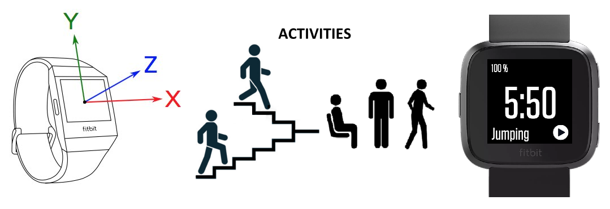
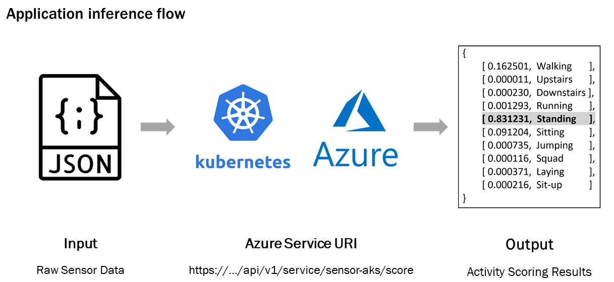
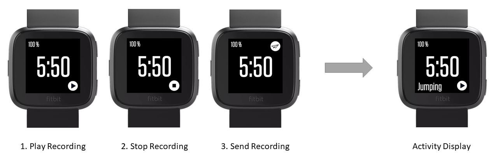

# Fitbit Activity Recognition Application.

Human activity recognition is the problem of classifying sequences of sensor data (typically: accelerometer, gyroscope, heart rate) recorded by specialized harnesses or smart devices into known well-defined movements.

The information retrieved from inertial sensors embedded in everyday devices, such as smartphones or smart watches, can be used to classify a set of physical activities through a supervised Machine Learning algorithm.

It is a challenging problem given the large number of observations produced each second, the temporal nature of the observations, and the lack of a clear way to relate sensor data to known movements.

Classical approaches to the problem involve hand crafting features from the time series data based on fixed-size windows and training machine learning models, such as ensembles of decision trees.

Recently, deep learning methods such as recurrent neural networks and convolutional neural networks (CNNs) have been shown to provide state-of-the-art results on challenging activity recognition tasks with little or no data feature engineering.




## About this Fitbit App

This Fitbit App collects sensory data at 10Hz and utilizes a Convolutional Neural Network classifier model to predict the activity performed by the human wearing the watch. 

The convolution neural network has been previously trained and deployed using [Azure ML Services](https://azure.microsoft.com/en-us/services/machine-learning-service/), the diagram bellow shows the basic inference flow.




## How to use this Fitbit App

This application has been developed only for Fitbit Versa and requires a web service for inference scoring.

The application is designed to send raw sensor data through a post request within the **uploadDataToServer** function under **./common/utilsCompanion.js**. You might need to update the fetch URI and Bearer token.

The inference web service hosting the classification model (convolutional neural network) should handle requests containing the raw sensor data in a json format and should return the classification result in a json format as well. As of now, the application is configured to send 'packages' of 6 sensor measurements (AccX, AccY, AccZ, GyroX, GyroY, GyroZ) with a 'window frame' of 10 samples each package (6x10 matrix). 

The expected POST request body format is:
```json
{"data" : 
"
  [
      [ AccX , AccY , AccZ , GyroX, GyroY, GyroZ ],
      [ AccX , AccY , AccZ , GyroX, GyroY, GyroZ ],
      [ AccX , AccY , AccZ , GyroX, GyroY, GyroZ ],
      [ AccX , AccY , AccZ , GyroX, GyroY, GyroZ ],
      [ AccX , AccY , AccZ , GyroX, GyroY, GyroZ ],
      [ AccX , AccY , AccZ , GyroX, GyroY, GyroZ ],
      [ AccX , AccY , AccZ , GyroX, GyroY, GyroZ ],
      [ AccX , AccY , AccZ , GyroX, GyroY, GyroZ ],
      [ AccX , AccY , AccZ , GyroX, GyroY, GyroZ ],
      [ AccX , AccY , AccZ , GyroX, GyroY, GyroZ ]
  ],
  [
      [ AccX , AccY , AccZ , GyroX, GyroY, GyroZ ],
      [ AccX , AccY , AccZ , GyroX, GyroY, GyroZ ],
      [ AccX , AccY , AccZ , GyroX, GyroY, GyroZ ],
      [ AccX , AccY , AccZ , GyroX, GyroY, GyroZ ],
      [ AccX , AccY , AccZ , GyroX, GyroY, GyroZ ],
      [ AccX , AccY , AccZ , GyroX, GyroY, GyroZ ],
      [ AccX , AccY , AccZ , GyroX, GyroY, GyroZ ],
      [ AccX , AccY , AccZ , GyroX, GyroY, GyroZ ],
      [ AccX , AccY , AccZ , GyroX, GyroY, GyroZ ],
      [ AccX , AccY , AccZ , GyroX, GyroY, GyroZ ]
  ]
"
}
```
The expected POST response format is:
```json
{"result" : "[ [5], [3] ]"}
```

Once the web service has been configured and the application is installed on the Fitbit, you need to manually start/stop the sensor recording and send the request through the buttons on the screen, see the diagram bellow.

